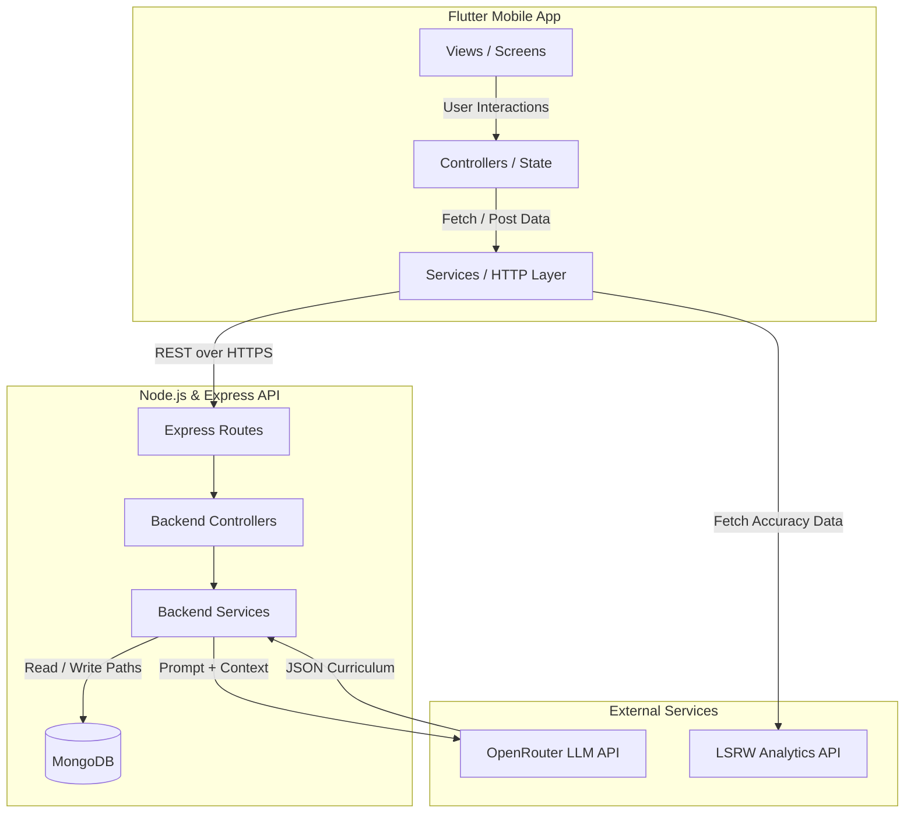
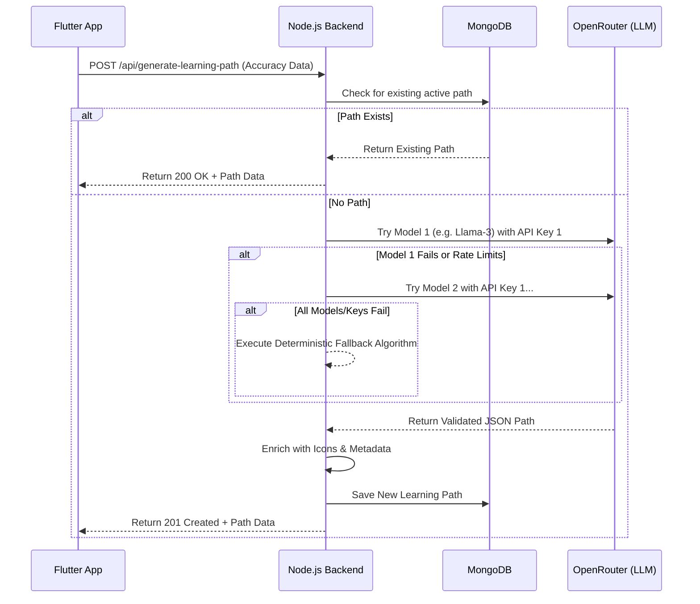
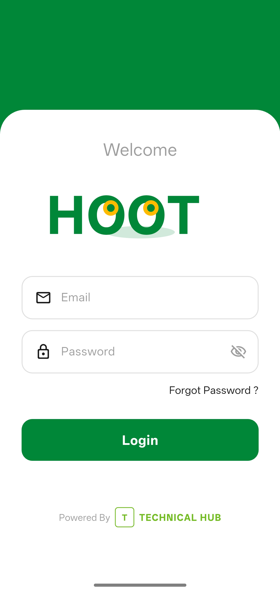
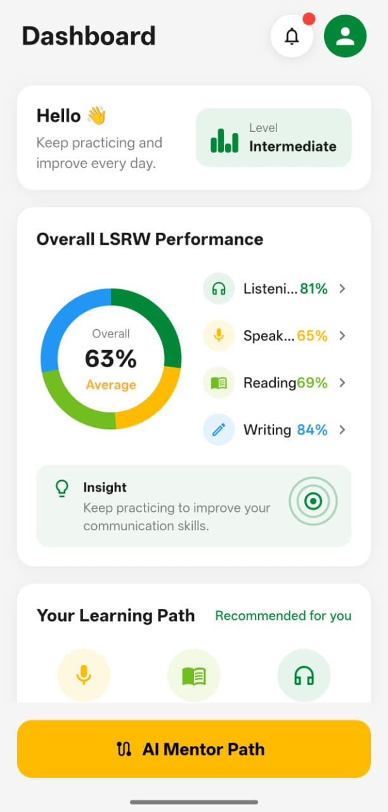
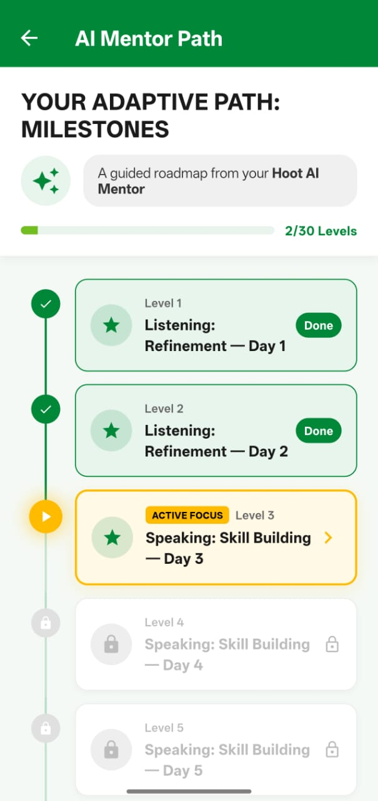

# 🦉 Hoot Path: AI-Powered Learning Path Generator


A comprehensive language and skill learning platform focusing on core **LSRW (Listening, Speaking, Reading, Writing)** skills. Hoot Path leverages advanced LLMs to provide users with a dynamically generated, hyper-personalized 30-day learning curriculum based on real-time performance analytics.

---

## 🛑 Problem Statement

The current version of the HooT app gives every student the exact same exercises for Listening, Speaking, Reading, and Writing regardless of their individual strengths and weaknesses. A student who scores 90% in Listening but only 30% in Writing receives the same exercise queue as every other student — the app has no mechanism to recognize this imbalance, no logic to redirect the student toward their weakest skill, and no insight into which specific sub-skills are the root cause of underperformance. Students plateau earlier than necessary because they are not being challenged in the right areas, engagement drops because practice feels repetitive and disconnected from personal progress, and the rich, granular performance data the HooT app already collects goes entirely unused for adapting the learning experience. HooT Path exists to close that gap.

## 💡 The Solution

**Hoot Path** solves this by acting as an intelligent AI Mentor.

1. **Continuous Analytics:** It pulls real-time performance accuracy across all LSRW modules.
2. **AI Curriculum Generation:** It feeds this data into an LLM via OpenRouter. The AI analyzes the gaps and generates a strict, personalized 30-day (or 30-level) learning path.
3. **Adaptive Focus:** If a user is weak in Speaking, the AI assigns "Speaking: Emergency Focus" days. If they are strong in Reading, it scales back Reading modules to "Maintenance".
4. **Actionable Insights:** It provides real-time, LLM-generated motivational insights on the dashboard based on the user's latest statistics.

---

## 📐 Architecture Diagrams

### System Architecture Overview



### AI Generation & Fallback Flow



---

## 🌟 Key Features

- **Strict MVC Frontend Architecture:** Codebase strictly separated into Models, Views, Controllers, and Services for maximum maintainability.
- **Dynamic AI Learning Path:** Generates 30-day curriculum based on exact weaknesses.
- **Live AI Insights:** Replaces hardcoded logic with live, LLM-generated recommendations displayed directly on the dashboard.
- **Redundant AI Pipeline:** Multi-model, multi-key fallback mechanism ensures the learning path is _always_ generated, falling back to a deterministic local algorithm only if the entire LLM provider network goes down.
- **Secure Certificate Pinning:** Network requests are secured with domain-specific SSL pinning to prevent MitM attacks.
- **Real-time Progress Tracking:** Visual timeline with completed, active, and locked days.
- **Personalized Skill Analysis:** Tier-based assessment (Critical, Weak, Moderate, Good, Strong) with progress bars.
- **Onboarding Experience:** Guided setup for new users.
- **Cross-Platform Support:** Built with Flutter for iOS, Android, Web, Windows, macOS, and Linux.

---

## 📱 Screenshots






- **Login Screen:** Secure authentication interface.
- **Onboarding:** Interactive setup process.
- **Skill Analysis:** Real-time accuracy breakdown with tier badges.
- **Learning Path Dashboard:** Visual timeline of 30-day curriculum.
- **Day Task Screen:** Detailed daily tasks with completion tracking.

---

## 💻 Tech Stack

### Frontend (Flutter)

- **Framework:** Flutter (Dart) SDK ^3.9.2
- **Architecture:** MVC (Model-View-Controller)
- **Networking:** `http` package (with custom secure SSL configuration)
- **State Management:** `ChangeNotifier` / `Listenable`
- **Dependencies:**
  - `cupertino_icons: ^1.0.8`
  - `device_preview: ^1.3.1`
  - `http: ^1.6.0`
  - `shared_preferences: ^2.3.2`
- **Testing:** `flutter_test`, `flutter_lints: ^5.0.0`

### Backend (Node.js)

- **Runtime:** Node.js
- **Framework:** Express.js ^5.2.1
- **Database:** MongoDB (via Mongoose ODM ^9.6.2)
- **AI Integration:** OpenRouter API (Accessing Llama 3, Mistral, Qwen, etc.)
- **Other Dependencies:**
  - `cors: ^2.8.6`
  - `dotenv: ^17.4.2`

---

## 🚀 Getting Started

### Prerequisites

- **Node.js** (v14 or higher) - [Download](https://nodejs.org/)
- **Flutter SDK** - [Installation Guide](https://docs.flutter.dev/get-started/install)
- **MongoDB** - Local or cloud instance (e.g., MongoDB Atlas)
- **OpenRouter API Key** - [Get one here](https://openrouter.ai/)

### 1. Backend Setup (`/backend`)

1. Navigate to the backend directory:
   ```bash
   cd backend
   ```
2. Install dependencies:
   ```bash
   npm install
   ```
3. Create a `.env` file in the backend root:
   ```env
   PORT=5001
   MONGO_URI=mongodb+srv://<username>:<password>@cluster.mongodb.net/hoot?retryWrites=true&w=majority
   OPENROUTER_KEY=sk-or-v1-...
   # Optional: Additional keys for fallback
   OPENROUTER_KEY1=sk-or-v1-...
   OPENROUTER_KEY2=sk-or-v1-...
   ```
4. Start the server:
   ```bash
   npm start
   ```
   The server will run on `http://localhost:5001`.

### 2. Frontend Setup (`/frontend`)

1. Navigate to the frontend directory:
   ```bash
   cd frontend
   ```
2. Install Flutter dependencies:
   ```bash
   flutter pub get
   ```
3. Run the application:
   ```bash
   flutter run
   ```
   This will launch the app on your connected device or emulator.

### 3. Testing

- **Backend:** No specific test scripts defined yet.
- **Frontend:** Run tests with:
  ```bash
  flutter test
  ```

---

## 📡 API Documentation

The backend provides a RESTful API for learning path management.

### Base URL

```
http://localhost:5001/api
```

### Endpoints

#### 1. Get Learning Path

- **Endpoint:** `POST /get-learning-path`
- **Description:** Retrieves the existing active learning path for a user.
- **Request Body:**
  ```json
  {
    "userId": "string"
  }
  ```
- **Response:** Learning path data or 404 if not found.

#### 2. Generate Learning Path

- **Endpoint:** `POST /generate-learning-path`
- **Description:** Generates a new AI-powered 30-day learning path based on user accuracy.
- **Request Body:**
  ```json
  {
    "userId": "string",
    "accuracy": {
      "listening": 75.5,
      "speaking": 60.2,
      "reading": 85.0,
      "writing": 45.8
    }
  }
  ```
- **Response:** Newly generated path data.

#### 3. Complete Day

- **Endpoint:** `POST /complete-day`
- **Description:** Marks a specific day in the learning path as completed.
- **Request Body:**
  ```json
  {
    "userId": "string",
    "day": 5
  }
  ```
- **Response:** Updated path data.

#### 4. Generate Insight

- **Endpoint:** `POST /generate-insight`
- **Description:** Generates AI-powered motivational insights based on user statistics.
- **Request Body:**
  ```json
  {
    "userId": "string",
    "stats": { ... }
  }
  ```
- **Response:** AI-generated insight text.

---

## 📂 Project Structure

```
Hoot_Path/
├── README.md                          # Project documentation
├── backend/                           # Node.js & Express API Server
│   ├── config/
│   │   └── db.js                      # MongoDB connection configuration
│   ├── controllers/
│   │   └── learningPath.controller.js # API request handlers
│   ├── models/
│   │   └── LearningPath.js            # MongoDB schemas (Mongoose)
│   ├── routes/
│   │   └── learningPath.routes.js     # API endpoint definitions
│   ├── services/
│   │   ├── openRouter.service.js      # OpenRouter LLM integration
│   │   └── pathGenerator.service.js   # Path generation logic
│   ├── server.js                      # Application entry point
│   ├── proxy_server.js               # Proxy server (if used)
│   ├── render.yaml                    # Deployment configuration
│   └── package.json                   # Node.js dependencies
└── frontend/                          # Flutter Application
    ├── analysis_options.yaml          # Dart analysis configuration
    ├── pubspec.yaml                   # Flutter dependencies
    ├── android/                       # Android-specific files
    ├── ios/                           # iOS-specific files
    ├── lib/                           # Dart source code
    │   ├── config/
    │   │   └── app_config.dart        # App-wide configuration
    │   ├── controllers/               # UI state management
    │   ├── models/
    │   │   ├── lsrw_models.dart       # LSRW data models
    │   │   └── ...                    # Other models
    │   ├── services/
    │   │   ├── learning_path_service.dart # API service layer
    │   │   ├── lsrw_api_service.dart  # LSRW analytics API
    │   │   └── ...                    # Other services
    │   ├── views/                     # UI screens
    │   │   ├── onboarding_screen.dart
    │   │   ├── login_screen.dart
    │   │   ├── learning_path_screen.dart
    │   │   ├── day_task_screen.dart
    │   │   ├── profilescreen.dart
    │   │   └── ...                    # Other screens
    │   └── main.dart                  # Flutter app entry point
    ├── assets/                        # Static assets
    │   └── onboarding/                # Onboarding images
    ├── build/                         # Build outputs
    ├── test/                          # Unit and widget tests
    │   ├── learning_path_controller_test.dart
    │   │   ├── lsrw_models_test.dart
    │   │   └── widget_test.dart
    └── windows/                       # Windows-specific files
```

---

## 🤝 Contributing

We welcome contributions! Please follow these steps:

1. Fork the repository
2. Create a feature branch: `git checkout -b feature/your-feature-name`
3. Commit your changes: `git commit -m 'Add some feature'`
4. Push to the branch: `git push origin feature/your-feature-name`
5. Open a Pull Request

### Development Guidelines

- Follow the MVC architecture strictly
- Write tests for new features
- Ensure code passes linting checks
- Update documentation as needed

---

## 📄 License

This project is licensed under the MIT License - see the [LICENSE](LICENSE) file for details.

---

## 👥 Authors

- **Your Name** - _Initial work_ - [Your GitHub](https://github.com/yourusername)

---

## 🙏 Acknowledgments

- OpenRouter for providing access to multiple LLM models
- Flutter team for the amazing cross-platform framework
- MongoDB for reliable database solutions
- All contributors and testers

---

## 📞 Support

If you have any questions or need help, please open an issue on GitHub or contact the maintainers.

---

_Made with ❤️ for language learners everywhere_
